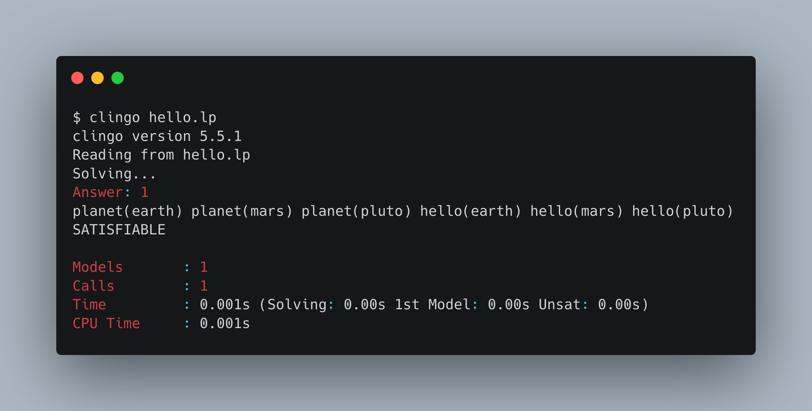
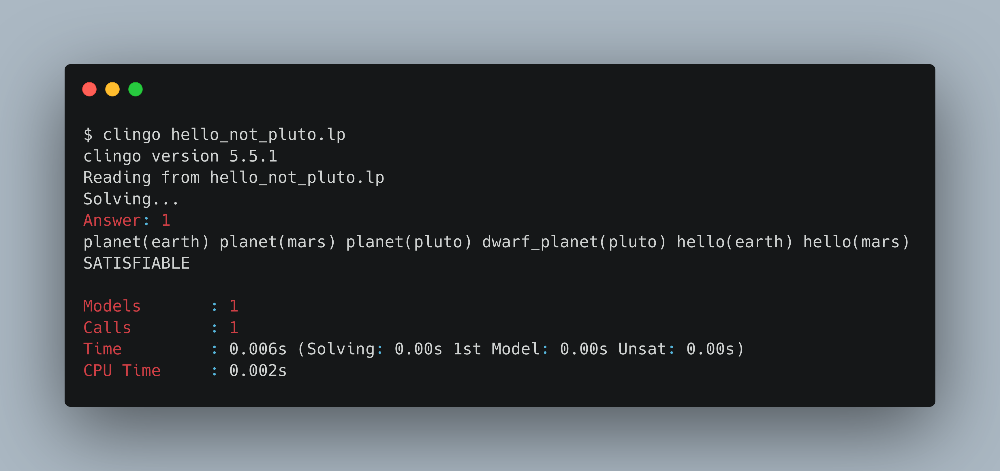

+++
title = "An Introduction to Answer Set Programming - Hello World and Installation"
date = "2022-01-20"
author = "Carson Woods"
description = "A Beginner's Guide to Answer Set Programming – Part 1"
+++

# What is Answer Set Programming?
Answer set programming is not a new programming language, but it is likely one you're unfamiliar with. Unlike most modern programming languages, answer set programming (ASP) is a declarative language and is syntactically comparable to [Prolog](https://en.wikipedia.org/wiki/Prolog). The functionality of ASP is not to execute a program but is instead to find so-called "stable models" or "answer sets" based on defined constraints and user input. Confused? I was too at first. Despite its incredible usefulness, there are very few good tutorials and explanations of actually *what* ASP is outside of lengthy guides and examples in academic papers.

This post is going to explain the basics of ASP. It'll include an introduction to basic syntax, two simple programs to illustrate functionality, and instructions how to get started writing ASP yourself.

# Hello World
ASP syntax is fairly basic, while also managing to be not particularly intuitive. Normally, most programming languages offer a "Hello, World!" example. One problem with doing that in ASP... there isn't really a concept of printing in ASP. Still, lets just write a comparable example and you should start to see what I mean. Below is a form of hello world in ASP:

```
planet(earth).
planet(mars).
planet(pluto).
hello(World) :- planet(World).
```
Ok lets take the above example and explain exactly what is going on there. First, let me say that ASP has no concept of functions. What you're seeing in the `planet()` and `hello()` syntax is what is called a predicate or an atom (these terms are fairly interchangeable so I'll stick with atom). Each atom is defining something to be true or known to the model. For example, line 1 reads `planet(earth)` tells ASP that there is a `planet` atom with attribute `earth`. The example goes on to define two more planet attributes, one for Mars and one for Pluto (yes I know Pluto's status as a planet is debatable, but that'll be useful later). Its also probably worth mentioning that every line has to be terminated with a period.

ASP is a declarative language so its important to not think of things being *run* one line at a time. Instead, think of lines 1-3 as all existing simultaneously. Once we know what is true, we can start to look at line 4. Line 4 is different from what we've seen before; its not an atom declaration, but a rule which defines something new. Reading line 4 shows us an unfamiliar atom: `hello(World)` followed by a strange looking `:-` and is finally followed with something that is somewhat familiar:  `planet(World)`. In ASP, lines that have a `:-` surrounded by other atoms, logic, etc. are called rules. The `:-` acts as a sort of "if" clause, stating that the head of the rule (in this case `hello(World)`) exists IF the body exists (in this case `planet(World)`).

Great, now you know what a rule is. But you might be asking where the `World` comes from in line 4. In ASP, attributes that begin with a capital letter are variables. Variables in ASP can be a bit weird to wrap one's head around because of their unusual scope. In line 4 of our above example, `planet(World)` is acting as a sort of wildcard for every `planet()` atom that we previously defined. A good way of *reading* line 4 would be: A `hello()` atom exists for a value of `World` **IF** a `planet()` atom exists for the same value of `World`. More succinctly stated, its converting anything defined as a planet into a hello. The reason why the scope is strange here is because that variable only exists within the context of that rule. If we were to create another rule using the same `World` variable expecting it to mirror line 4's value, we'd be wrong.

And that's it. Yes it did take 3 paragraphs to (possibly over-)explain what was going on, but that's the basics. Oh and in case you think I forgot, I will actually show you how to run an ASP program and what the output of our example is, but that will come later.

### Hello World (again)
Now that you've got the basics of Atoms and Rules down, lets quickly make a few modifications to our hello world example with some slightly new syntax and see what happens.
```
planet(earth).
planet(mars).
planet(pluto).
dwarf_planet(pluto).
hello(World) :- planet(World), not dwarf_planet(World).
```
In this example a new atom is introduced (`dwarf_planet()`) and some extra changes are made to our rule. Lets say that we only want to *say* hello to planets that are not also dwarf planets. Seems a little mean to Pluto, but fair enough. Our introduction of the `dwarf_planet()` atom simply creates a new atom with the same attribute of `pluto`. Then in our following rule, we're stating that if a `World` is a planet AND NOT a dwarf planet, then we create a corresponding `hello()` atom for the planet. This would include Earth and Mars, but exclude Pluto. The `not` is pretty self explanatory and the separation of atoms with a `,` acts like a logical "and".

### Running Examples
The title of this section is a bit misleading because there isn't actually something being *run*. Instead its better to think of "running" the examples as solving them instead. The point of ASP is to get a solution set as output, so solving is the best way to think about it. Over the years, many ASP solvers have come into existence, but I recommend using the excellent [Clingo](https://potassco.org/doc/start/) which is developed and maintained by a working group at University of Potsdam. You can follow the linked instructions to get Clingo installed on your machine, or you can use their web-based solver [HERE](https://potassco.org/clingo/run/) to run the examples in a browser. Just as a quick side-note, the web-based solver has some built-in examples which range in difficulty to understand, and can serve as a good basis for learning more.

Lets assume you're running this on your local computer. Once you have clingo installed, you can copy the example into a `hello.lp` file. The name of the file is irrelevant, but a `.lp` extension is recommended. Then simply run the program with `clingo hello.lp` and you should see something similar to the following:

Lets quickly dissect what is going on here. First, we're presented with the Clingo version being used and the filename being read by Clingo (you can pass multiple files in at once, but that is a more complex topic and isn't relevant now). Clingo then shows that its solving the example with `Solving...` and then presents an answer if it can find one. Then we get our answer set output that we're looking for `planet(earth) planet(mars) planet(pluto) hello(earth) hello(mars) hello(pluto)`. Immediately we can see there are the `planet()` atoms we created, as well as 3 generated `hello()` attributes (one for each planet). Then we see `SATISFIABLE` which is Clingo informing us that the model is stable (aka solvable). If you have conflicting logic then no answer sets would be generated and `UNSATISFIABLE` would be printed.  After this you get some diagnostics on the solve. The only important bit of detail right now is the `Models: 1` line. This means that there was only 1 stable model that met your constraints. If more were available a `+` would be shown next to the 1. A future tutorial will describe how to view more than one model.

Now that we know what we’re expecting, lets take a look at the variation on the hello world example where we exclude poor Pluto:

As you can see, the results are incredible similar with the only exception being there is no `hello(pluto)` atom generated due to our additional constraints.

# Conclusion
I think its about time I wrap up this post. By now, you can create simple stable models in answer set programming and understand the basics of the syntax. There is MUCH more to cover and I intend to do so in future blog posts. Answer set programming is currently a very niche technology, but the use-cases are widespread. It might be hard to see now, but ASP makes it possible to model very complex and highly constrained logic problems. An example of this is ASP's role in
[Spack, a package manager for supercomputers](https://spack.io/). Using ASP, Spack is able to determine how best to install packages (and a package's entire dependency hierarchy) from source. ASP helps to manage dependency conflicts, dependency version requirements, etc. while also maintaining high levels of runtime performance.

I hope that you've enjoyed reading this introduction to ASP. This is my first time writing an introduction to a programming language, so if you have any suggestions for how to structure future posts please feel free to leave a suggestion below.


