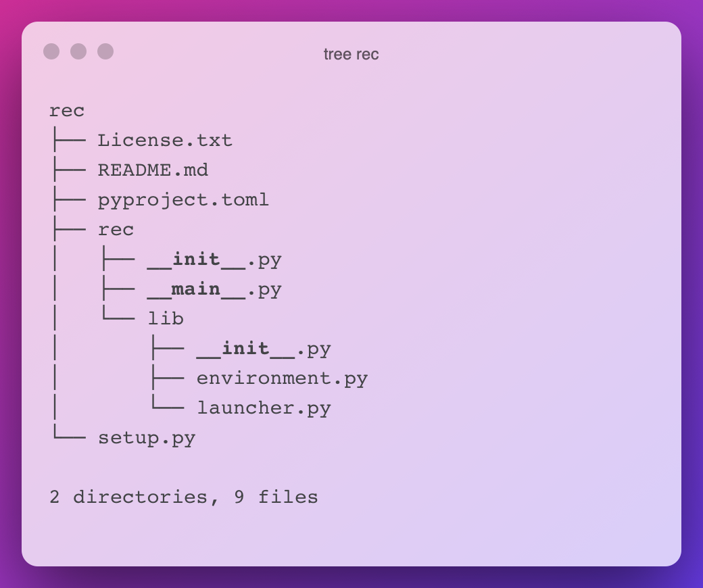
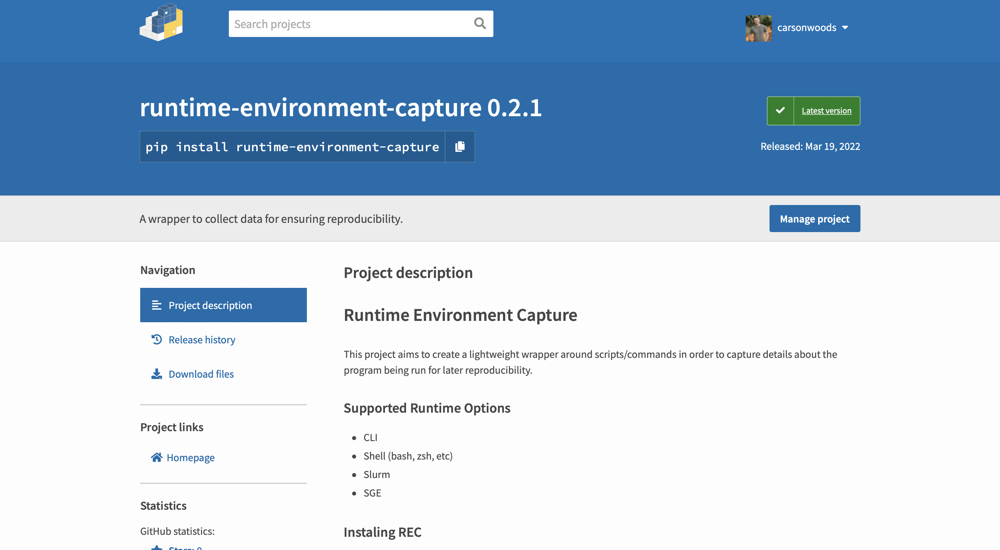

+++
title = "Publishing Your First Python Package"
date = "2022-03-23"
author = "Carson Woods"
description = "A guide to publishing a Python package."
+++

If you're reading this, you're probably already somewhat familiar with Python packages, how they work as an end-user and the various different types of packages. For those of you who are not familiar, I'll briefly explain. Python, like many other languages, uses a module-based import system to load parts of the language that are not available by default. You can also install 3rd parties tools and libraries through Python to expand language features or to simply act as independent Python-based utilities. These packages are generally installed using a package manager. Python provides a package manager ([pip](https://pip.pypa.io/en/stable/)), but other [options do exist](https://python-poetry.org/).

Package managers rely on a centralized repository to know what packages are available to be installed. Python package managers typically rely on the Python Package Index (PyPI) list of packages. This is what I'll be discussing today: how to publish a package on PyPI so that it can be installed by anyone.

### Structuring the Package

I recently created a new Python package and this tutorial will be based on publishing my new utility: Runtime-Environment-Capture (REC). My project already exists, but let's assume that you're starting from scratch. You'll need a directory for your new project so go ahead and create one. A common convention for structuring packages is to create a parent folder that will store top-level information and config files about the project and then create a secondary directory (named after the package) that will be where source code is written. For example, with my package REC, I structured the project like this:




All of the source code for REC lies in the `rec/rec` folder. From now on I'll refer to the top-level folder as the root folder and the subdirectory will be the module folder. This structure is not absolutely necessary, but it helps to logically separate your project. Feel free to experiment with whatever format works best for you. Aside from those recommendations, you can structure your project more or less however you feel like it. There are 2 other important things to keep in mind though. For an application-type package, a `__main__.py` file is necessary as it acts as the default entry point for your program. If you're familiar with C program linking, this is similar to the `_start` symbol that a compiler creates to tell your computer where to start executing code. This main file will do just that for our Python module. Once you've created the file, you can have it call any other function in any other file, but it's important to start here. Inside the `__main__.py` file, you should have the following code block:

```python
if __name__ == '__main__':
    # Your Code Here
```

That logic should lie outside of any function and serves as a check to ensure that the program is being started like normal. If you've defined a start function for your program elsewhere, this is a good place to call it. Something like this is fine (be sure to adapt it to your own code):

```python
def main():
    print("Hello World")

if __name__ == '__main__':
    main()
```

The second thing to keep in mind is that, inside the nested directory that contains your source code, you need a `__init__.py` file. This file can be empty and is simply letting Python know that you are defining a new module with the name of the current directory. **It's also important to note that any subdirectories of your project need this as well if you want them included in the final package that is published.
**

Next, it is a good idea to have a `README.md` file in your root level directory which provides a detailed description of your project. This will become the primary description of your project on the PyPI page which lists your package.

You should also choose a license for your project and place it in a `License.txt` file in the root directory. The license you choose is up to you, but if you need help choosing one check out this site:
[https://choosealicense.com](https://choosealicense.com).

Once you have done that, you now have all the necessary components to publish the Python package. Now you need to build the package into a distributable file. We'll cover that in the next section.

### Building the Package

So you want to build a package?

To build a package, we're going to need to create 2 more files in the root directory of your project. First, create a file called `pyproject.toml` and place the following code inside of it:

```toml
[build-system]
requires = ["setuptools>=42"]
build-backend = "setuptools.build_meta"
```

This file tells the build-system that you're going to be using the "setuptools" method of building your package. Setuptools is simply the Python-provided mechanism of building a package for distribution. You can specify other things in this file, but for this tutorial, we'll skip that as it's not strictly necessary.

The next file you should create is a `setup.py` file in your root directory. I'll explain what every line does in the file, but

```python
from setuptools import setup, find_packages

with open("README.md", "r", encoding="utf-8") as fh:
    long_description = fh.read()

setup(
    name="runtime-environment-capture",
    version="0.2.1",
    author="Carson Woods",
    description="A wrapper to collect data for ensuring reproducibility.",
    long_description=long_description,
    long_description_content_type="text/markdown",
    url="https://github.com/carsonwoods/rec",
    repository="https://github.com/carsonwoods/rec",
    documentation="https://github.com/carsonwoods/REC/wiki",
    license="MIT",
    classifiers=[
        "License :: OSI Approved :: MIT License",
        "Programming Language :: Python :: 3",
        "Intended Audience :: Developers",
        "Intended Audience :: Information Technology",
        "Intended Audience :: Science/Research",
        "Operating System :: MacOS",
        "Operating System :: POSIX :: Linux",
        "Operating System :: Unix",
    ],
    python_requires='>=3.6',
    packages=find_packages(),
    entry_points={
        "console_scripts": [
            "rec=rec.__main__:main",
        ]
    },

)
```

Let's start from the first line, you're importing the all-important `setup()` function from setuptools, along with a `find_packages()` function as well. The setup function helps to define metadata for your package that will appear on your package's listing, as well as some other build information.

The next thing that occurs is we're reading a file. Specifically, we're reading the `README.md` we made earlier. That is going to be our longer description. Since the PyPI website can parse Markdown, it's easier to define this in an external file and read it into a variable value than to try and include it inline. Plus, it makes your project look better-documented on Github or Gitlab if you're making it available there as well.

Then we call the `setup()` function with a *lot* of parameters. First is the name. This name *MUST* be unique. For better or worse, PyPI does not use a `[username]/[project-name]` scheme like Github does, so your project will end up with a URL that looks like "https://pypi.org/project/runtime-environment-capture/". If you try and upload a package with the same name as some other package, it will fail. Then, you'll want to specify a version. I use the Major.Minor.BugFix style for my version, however, you may prefer a date-based version system. It's up to you.

The next few lines are very simple. You simply write information that will appear in the sidebar and main page for your package on the PyPI listing. A `description` and `long_description` are self-explanatory (though do note that our `long_description` uses the variable we created from our README file earlier in the file). Then we specify the type of text that we're using to display the long description. This is so the file is properly parsed by the PyPI website into a human-readable format. The URL, repository, and documentation pages are also self-explanatory. Those will create links to the homepage, source code page, and documentation page for your project. In many cases, this could be the same link. It is not required to include these links, but I recommend including a URL at the very least. Finally, you also should specify which license you are releasing your software with. This plays a large role in whether some companies can use your package, so it's always good to include. To give you an idea of what these parameters do, they populate the following page for your package:



The next line (or few lines) is a dictionary of "classifiers". These are PyPI-provided tags that act as a form of SEO for your package. They form collections of packages that match the specified tags. A full list of classifiers is available here: [https://pypi.org/classifiers/](https://pypi.org/classifiers/).

The last few parts of the file define some build components of the package. The first `python_requires` defines the minimum required version that the Python package works on. The second is a `packages=find_packages()` line. This line tells the setup process to recursively look for modules in subdirectories. This is incredibly important because you'll presumably need code in all of the subdirectories that you've created for your project. The last parameter is `entry_points`. This is particularly useful in Python packages that act as standalone utilities and it lets users invoke your package without having to type out `python -m [package name] [args]` every time. In my above example, I'm stating that the `rec` command will invoke the `main()` function in the file `__main__.py` in the folder `rec`.

Now, you're *finally* done. All that is left is to build the project. Quickly be sure that you have setup tools installed by running:
```bash
pip install setuptools
```

Then you can run
```bash
python setup.py sdist bdist_wheel
```

If everything goes well, you should see three new directories. A `build/`, `dist/`, and directory named after your package that ends in a `.egg-info`. If you ever need to re-build your package, you can delete these directories and rebuild them using the last command.

And ta-da. You're done. This is, by far, the most time-consuming part of preparing your package. Now you're ready to move on to publishing it for all to see.

### Publishing the Package

Now that you've got a project ready to be published, you're going to want to create an account on the following websites:

[https://pypi.org](https://pypi.org)

[https://test.pypi.org](https://test.pypi.org)

As mentioned, PyPI is the primary package index and this is where we'll publish our package. The test.pypi.org page is an entirely separate instance of the pypi.org server and can be used to test releases *before* uploading them to the main PyPI instance.

Once you've created an account, you're ready to start uploading a package. From your terminal, install a utility called twine using pip:

```bash
pip install twine
```

Twine is a utility that uploads projects to PyPI. To use twine to make sure that your build process went smoothly, you can run the following on your newly created `dist/` folder:

```bash
twine check dist/*
```

#### Testing the Waters

First, let's test our package on the PyPI test server. When you're ready to publish, run

```bash
twine upload --repository-url https://test.pypi.org/legacy/ dist/*
```

You'll be asked to authenticate with the credentials for your PyPI test account. Do so now. If everything goes well, your package should now be available to install on the test repository. If you go to the test repo homepage, you should see your package under the "New releases" section and it should be searchable.

Go to the package listing page and make sure everything looks correct. Next, try installing the package using pip with the following command (insert your own package name of course):

```bash
pip install -i https://test.pypi.org/simple/ [package-name]
```

If the package installs correctly and runs as expected, you're good to go on the final upload.

#### Ready to Launch

Uploading your project is simple. You can simply ensure that your build is ready for upload and run the following:

```bash
twine upload dist/*
```

Enter your credentials for the main version of PyPI watch as your project gets uploaded 🎉🎉!!

Congratulations! You're now a Python package author!!

#### Important Notes
One last section of notes for this section with some important extras:

- You can't rename a project once it has been created. You can rename it, but it will create a new repository listing and you will break any packages which depend on that package explicitly. Be *very* deliberate in choosing a package name.
- You can't overwrite a version without first deleting a version in the PyPI dashboard. Before publishing a new version of a package on PyPI, you'll need to increase the version in the `setup.py` file.

### Automating Updates with Github Actions

Now, if you've made it this far, you're clearly a programmer. And if you're a developer you almost [certainly love automating things](https://xkcd.com/1319/). Sure you *can* just run the `twine upload dist/*` command every time, but why do something by hand when you don't have to? If this was exactly your train of thought then I have great news for you! Now that we have our `setup.py` and project, we can completely automate this deployment using Github Actions!

This part of the project assumes you're publishing your project on Github. Technically it's not *strictly* necessary, but it really helps for that to be the case. With that assumption out of the way, let's get going.

First, you'll need to go to PyPI and generate an API key for your account. This can be done in the settings for your account. For security reasons, I recommend setting access to the key to only the project you'll be deploying. We'll be using a [Github Secret](https://docs.github.com/en/actions/security-guides/encrypted-secrets) for this API key, but the [principle of least privilege](https://www.cisa.gov/uscert/bsi/articles/knowledge/principles/least-privilege) exists for a reason. Once you have the API key, go to the settings page for your repository where your package's code is stored. Under the Security tab in Settings, you'll see a Secrets section with an Actions subsection. Using that menu, create a new key with the name `PYPI_API_TOKEN` and the value being set to the previously generated API key.

Once you've done this, click on the Actions tab for your repository and click "New Workflow". The "Publish a Python Package" is a preset option for Python-based projects, but I'll include the code below for the workflow file:
```yaml
# This workflow will upload a Python Package using Twine when a release is created
# For more information see: https://help.github.com/en/actions/language-and-framework-guides/using-python-with-github-actions#publishing-to-package-registries

# This workflow uses actions that are not certified by GitHub.
# They are provided by a third-party and are governed by
# separate terms of service, privacy policy, and support
# documentation.

name: Upload Python Package

on:
  release:
    types: [published]

jobs:
  deploy:

    runs-on: ubuntu-latest

    steps:
    - uses: actions/checkout@v2
    - name: Set up Python
      uses: actions/setup-python@v2
      with:
        python-version: '3.x'
    - name: Install dependencies
      run: |
        python -m pip install --upgrade pip
        pip install build
    - name: Build package
      run: python -m build
    - name: Publish package
      uses: pypa/gh-action-pypi-publish@27b31702a0e7fc50959f5ad993c78deac1bdfc29
      with:
        user: __token__
        password: ${{ secrets.PYPI_API_TOKEN }}
```

As you can see, the password that is passed to the PyPI publish action is the `PYPI_API_TOKEN` secret we created. This workflow will create a new version on PyPI whenever a new version is released on Github.

To create a new release on Github, simply make the changes you want to make to your project, increment the version in your setup file, and commit tag your changes. Then, go to your projects page on Github and click on the releases tab to create a new release. Write up the release changes, name the version, and upload the source code files found in your dist/ directory. I’m glossing over the details here because it falls outside the scope of the tutorial and isn't really that relevant given that most users install packages with pip. This release is only for your users who might get their packages from installing from source on Github. The key thing here is that, per our workflow earlier, publishing a new release on Github will trigger the workflow we made earlier and it will upload your most recent commit to PyPI. Once you publish the release, you can track the progress of the automation from the Actions tab. It will display an error message if the publishing process fails, but if all goes well, your new update to your package will be visible on PyPI.

### Conclusions
Hopefully, this was a clear and reasonably-comprehensive introduction to publishing a Python package. It is by no means exhaustive and Python's setuptools offers substantially more options for configuring your package. There are also other build systems aside from setuptools, however, I wanted to keep this to the basics for a first post on the topic.

Thanks so much for reading and if you've made it this far, I'd love if you could take a look at my new Python package: [runtime-environment-capture (REC)](https://pypi.org/project/runtime-environment-capture/). It's still very much in "beta", but I'm rapidly adding new features. If you want an extra tool to help ensure reproducible scripts/digital experiments/etc., you might want to see what it can do!
